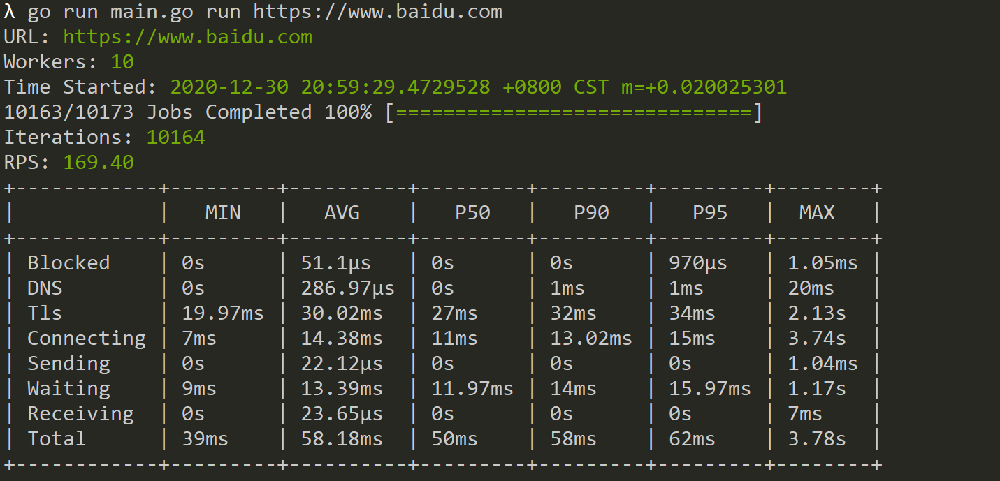

# APIGO 

APIGO is a http load testing tool written in Go. It allows user
to run a load test against a url for a specified time, and concurrency level.

## Quick Start
For help
`go run main.go -h` 

To load test www.baidu.com, using 10 connections
`go run main.go run https://www.baidu.com -c 10`


## Usage
```
Usage:
  runner run [flags]

Flags:
  -c, --Concurrent Connections int   Number of concurrent connections (default 10)
  -d, --body string                  Request body
      --csv string                   Output metrics to CSV file
  -t, --duration string              Test duration (default "1m")
  -H, --headers string               Request Headers
  -h, --help                         help for run
  -x, --method string                Request method (default "GET")
```

## Screenshot



## Libraries Used
- Color for coloured terminal output.
- Tablewriter for tabled output in terminal.
- Cobra for CLI commands.
- Progressbar for displaying load test progress in terminal.
- Stats - For calculating StdDev.

